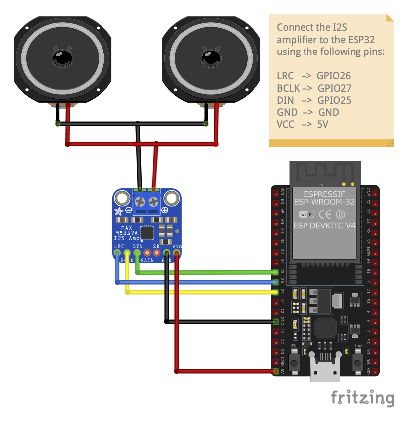

# GENERAL IMPORTANT INFORMATION
*This short section must be read for proper operation.*

## Artwork Description
a simplified online-mode build of GhostWhisper that streams audio and serves files from a remote server (no SD card). All device logic is moved to a separate server.

## Medium 
Speaker units, amplifier, ESP32 microcontroller, WiFi network, custom software.

## List of Components (PER MODULE) 
1 pc	\-	NodeMCU-32s ESP32 Microcontroller  
1 pc	\-	Max98357 Amplifier Module  
1 set	\- 	Speakers  
(OPTIONS: Two units of 4Ω3W full-range speakers or one unit of 8Ω15-20W horn speaker)  
1 pc	\- 	5V Power Supply Unit  
1 set	\- 	Male to Female Dupont Wires 40cm  
1 set \-	Female to Female Dupont Wires 40cm  
2 pcs \-	Terminal block connectors  
1 set \-	Heat-shrink tubing (black)

**Other important tools:**

* Small flathead screwdriver  
* Phillips screwdriver  
* Wire stripper or diagonal cutters  
* USB-C cable for uploading the code to the microcontroller  
* Computer installed with **VS Code** and **PlatformIO IDE**  
* Optional: Soldering tools (soldering iron and solder lead)

## Wiring Diagram (PER MODULE)

## Assembly Instructions

1. Upload code to ESP32 microcontroller (required: computer with VS Code \+ PlatformIO & data cable):  
     
   Clone the repository from [https://github.com/kolown2007/ghostwhisper](https://github.com/kolown2007/ghostwhisper) and open it in PlatformIO.  
     
   Connect the ESP32 to your computer using the data cable (USB-C to USB-A) it came with and click the upload button in PlatformIO. Make sure to press the reset button of the ESP32 while uploading the code.

2. Strip the end of the wires of speaker modules or solder wires to the anode and cathode pins of the speaker/s if it did not come with pre-soldered wires.

3. Connect the speaker wires to the amplifier module using terminal blocks on the amplifier module:  
     
   Unscrew the ground side of the green terminal block which is marked with a (-) symbol. Insert both ground wires (black wire) of the speaker into the conductor insertion point then tighten back the screw to secure the connection. Do the same method for the power wires (red wire) and connect them to the power side of the terminal block which is marked with a (+) symbol.

4. Prepare the connections:  
     
   Connect the female end of the male to female dupont wires to the LRC, BCLK, DIN, GND, and VCC pins of the amplifier module.

   Next, connect the female end of the male to female dupont wires to the GPIO25, GPIO26, GPIO27, GND, and 5V pins of the ESP32 microcontroller.

5. Connect the amplifier module pins to the ESP32 using a 5-pin terminal block:  
     
   Remove the protective lid of the terminal block. Unscrew the top and bottom screw using a phillips screwdriver. It is best to start with one column at a time to avoid mismatching the pins. Use the same color for each individual connection.

   Refer to the diagram below for the connections:

| Max98357 Amplifier | NodeMCU-32s ESP32 microcontroller |
| :---: | :---: |
| LRC | GPIO26 |
| BCLK | GPIO27 |
| DIN | GPIO25 |
| GND | GND |
| VCC | 5V |

   Insert the male end of the dupont cable to the conductor insertion point of the terminal blocks and tighten screws. Attach the protective cover back to the terminal block.

6. Power the ESP32 using a dedicated 5V Power Supply Unit by connecting the USB-C end of the power supply to the ESP32. Plug the power supply to a wall outlet.

## Troubleshooting
\[TO BE UPDATED\]

## Basic Troubleshooting
\[TO BE UPDATED\]

## Contact Us

For issues unresolved by the basic troubleshooting instructions provided, please collect and send the following information to the artist/s *(preferrably through email)*:

* Description of the problem;  
* Date and time;  
* Detailed video of the whole artwork;  
* Detailed photograph of the suspected faulty component w/ annotation/s;  
* Detailed photograph of the circuitry;  
* Resolutions made prior to contacting the artist/s;  
* Personnel involved.