# GENERAL IMPORTANT INFORMATION
*This short section must be read for proper operation.*

## Artwork Description
A simplified online-mode build of GhostWhisper that streams audio and serves files from a remote server (no SD card). All device logic is moved to a separate server.

## Medium 
Speaker units, amplifier, ESP32 microcontroller, WiFi network, custom software.

## List of Components (PER MODULE) 
1 pc	\-	NodeMCU-32s ESP32 Microcontroller  
1 pc	\-	Max98357 Amplifier Module  
1 set	\- 	Speakers  
(OPTIONS: Two units of 4Ω3W full-range speakers or one unit of 8Ω15-20W horn speaker)  
1 pc	\- 	5V Power Supply Unit  
1 set	\- 	Male to Female Dupont Wires 40cm  
1 set \-	Female to Female Dupont Wires 40cm  
2 pcs \-	Terminal block connectors  
1 set \-	Heat-shrink tubing (black)

**Other important tools:**

* Small flathead screwdriver  
* Phillips screwdriver  
* Wire stripper or diagonal cutters  
* USB-C cable for uploading the code to the microcontroller  
* Computer installed with **VS Code** and **PlatformIO IDE**  
* Optional: Soldering tools (soldering iron and solder lead)

## Wiring Diagram (PER MODULE)

## Assembly Instructions

   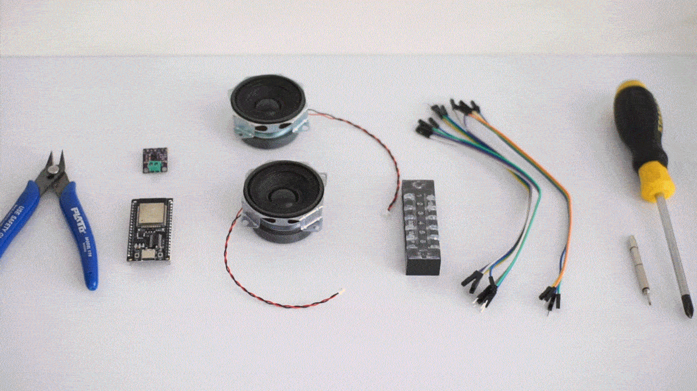

1. Install the required software on your computer:

   |  | MacOS | Windows |
   | ----- | ----- | ----- |
   | Visual Studio Code (VS Code) | [https://code.visualstudio.com/Download](https://code.visualstudio.com/Download)  |
   | PlatformIO (installed within VSCode) | [https://platformio.org/platformio-ide](https://platformio.org/platformio-ide)  |
   | CH340 Driver | https://github.com/WCHSoftGroup/ch34xser\_macos  | [https://www.wch-ic.com/downloads/CH343SER\_ZIP.html](https://www.wch-ic.com/downloads/CH343SER_ZIP.html) |

   Related links:
   https://learn.adafruit.com/how-to-install-drivers-for-wch-usb-to-serial-chips-ch9102f-ch9102

2. Upload code to ESP32 microcontroller (required: computer with the installed software mentioned above & data cable):  
     
   Clone the repository from [https://github.com/kolown2007/ghostwhisper](https://github.com/kolown2007/ghostwhisper) and open it in PlatformIO by clicking the PlatformIO icon on the left panel. Under "Quick Access" open "PIO Home" and click "Open", this will lead you to the PlatformIO homepage. Click "Import Arduino Project" and select **"NodeMCU-32S"** as your board. Click on the directory that contains the **ghostwhisper** folder downloaded from the github link above. Open the **ghostwhisper** folder and click **IMPORT**.
   
   On the second to the left panel of your workspace, under "GHOSTWHISPER", open the **"src"** folder and open **"main.cpp"**.
     
   Connect the ESP32 to your computer using the data cable (USB-C to USB-A) it came with and click the upload button in PlatformIO. Make sure to press the BOOT button of the ESP32 while uploading the code, do not release until the code has been fully uploaded. Press the RST (reset) button of the ESP32 to refresh the program on the ESP32. 
   
   Keep the ESP32 plugged into your computer.

3. Configure the ESP32 to access the WiFi. You may use your computer or phone for this step.

   Open your WiFi Settings and connect to the SSID name **ghostwhisper**, this will redirect you to the **WiFiManager** landing page of ghostwhisper.

   Click on the Configure WiFi button and enter the WiFi credentials (SSID and Password). Once done this will save the WiFi credentials and connect the ESP32 to the network.

   Once connected to the WiFi, you will hear a sound indicating that the connection was successful.

   Unplug the ESP32 from your computer.

3. Start assembling the circuit:

   Strip the end of the wires of speaker modules or solder wires to the anode and cathode pins of the speaker/s if it did not come with pre-soldered wires.

   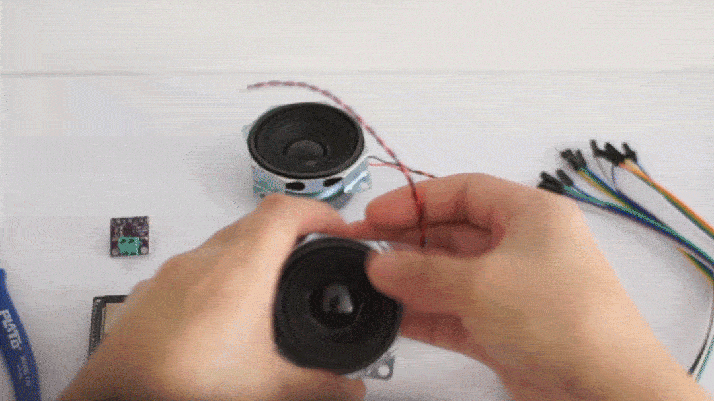

4. Connect the speaker wires to the amplifier module using the green terminal blocks on the amplifier module.

   Unscrew the ground side of the green terminal block which is marked with a negative (-) symbol. Insert both ground wires (black wire) of the speaker into the conductor insertion point then tighten back the screw to secure the connection. Do the same method for the power wires (red wire) and connect them to the power side of the terminal block which is marked with a positive (+) symbol.

   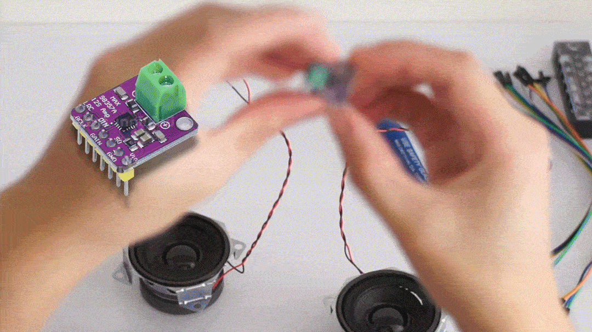

5. Prepare the connections:

   Connect the female end of the male to female dupont wires to the LRC, BCLK, DIN, GND, and VCC pins of the amplifier module.

   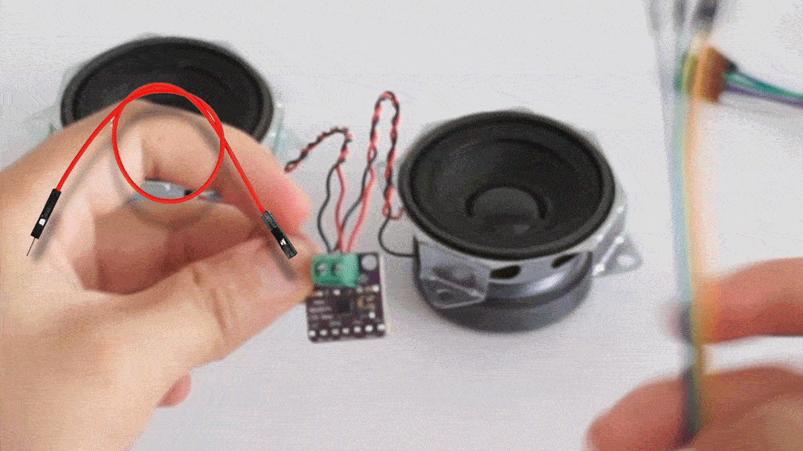 

   Next, connect the female end of the male to female dupont wires to the GPIO25, GPIO26, GPIO27, GND, and 5V pins of the ESP32 microcontroller.

   

6. Connect the amplifier module pins to the ESP32 using a 5-pin terminal block:  
     
   Remove the protective lid of the terminal block. Unscrew the top and bottom screw using a phillips screwdriver. It is best to start with one column at a time to avoid mismatching the pins. Use the same color for each individual connection.

   Refer to the diagram below for the connections:

   | Max98357 Amplifier | NodeMCU-32s ESP32 microcontroller |
   | :---: | :---: |
   | LRC | GPIO26 |
   | BCLK | GPIO27 |
   | DIN | GPIO25 |
   | GND | GND |
   | VCC | 5V |

   Insert the male end of the dupont cable to the conductor insertion point of the terminal blocks and tighten screws. Attach the protective cover back to the terminal block.

   

   

7. Power the ESP32 using a dedicated 5V Power Supply Unit by connecting the USB-C end of the power supply to the ESP32. Plug the power supply to a wall outlet.
   

**Full video instructions (no audio) can be accessed here: https://youtu.be/pFi20m0UNg8**

## Images of Components (with Links for Material Procurement)

| Component Name :  | NodeMCU-32s ESP-32 Microcontroller (38pins) |
| ----- | :---: |
| Description: | The processor board responsible for running code and connecting to WiFi. |
| Shopee (Thailand) Link:  | [Shopee \- SELLER NAME: AEI.th](https://shopee.co.th/ESP32-WiFi-Node32s-ESP-32-ESP-32S-NodeMCU-ESP-WROOM-32-WiFi-Bluetooth-%E0%B8%A1%E0%B8%B5%E0%B8%82%E0%B8%AD%E0%B8%87%E0%B8%9E%E0%B8%A3%E0%B9%89%E0%B8%AD%E0%B8%A1%E0%B8%AA%E0%B9%88%E0%B8%87%E0%B8%97%E0%B8%B1%E0%B8%99%E0%B8%97%E0%B8%B5-i.117988183.2053436592?sp_atk=cfe1f287-e40d-45f5-94a5-bb42284281be&xptdk=cfe1f287-e40d-45f5-94a5-bb42284281be) |
| | 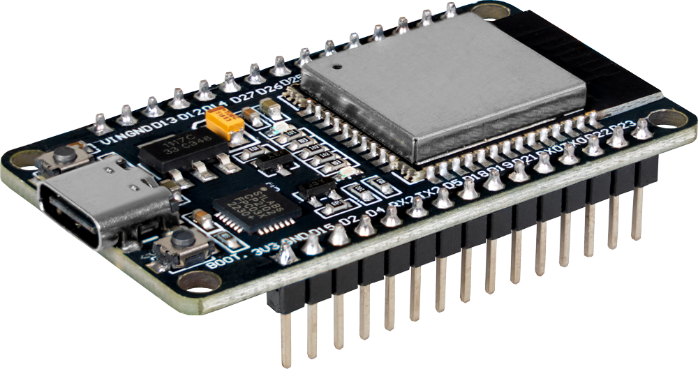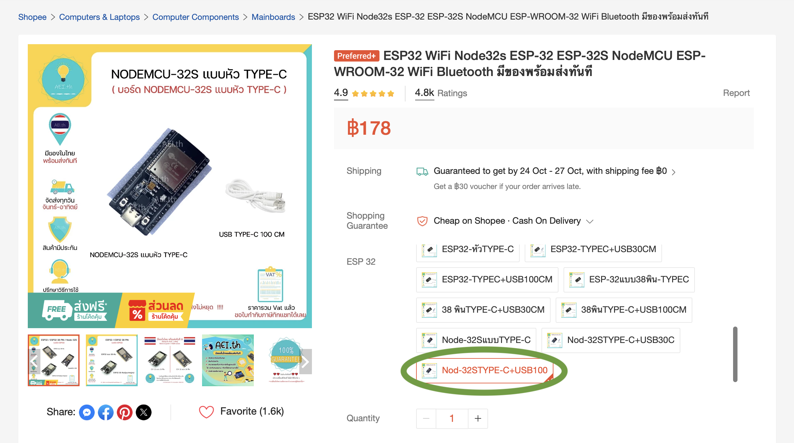 |

| Component Name :  | Max98357 3W Class D Amplifier Breakout Board Module |
| ----- | :---: |
| Description: | The MAX98357 is an amplifier module that uses an Inter-Integrated Circuit Sound (I2S) serial interface protocol |
| Shopee (Thailand) Link:  | [Shopee \- SELLER NAME: โอ.อาร์. เทคโนโลยี](https://shopee.co.th/โมดูลขยายเสียง-บัดกรี-ไม่บัดกรี-MAX98357-I2S-3W-Class-D-Amplifier-Breakout-Interface-Dac-Decoder-Module-Audio-Amplifi...-i.944231623.26560069128?sp_atk=ff5fc91a-9817-4f18-bcb5-3b17607cda59&xptdk=ff5fc91a-9817-4f18-bcb5-3b17607cda59) |
|  | 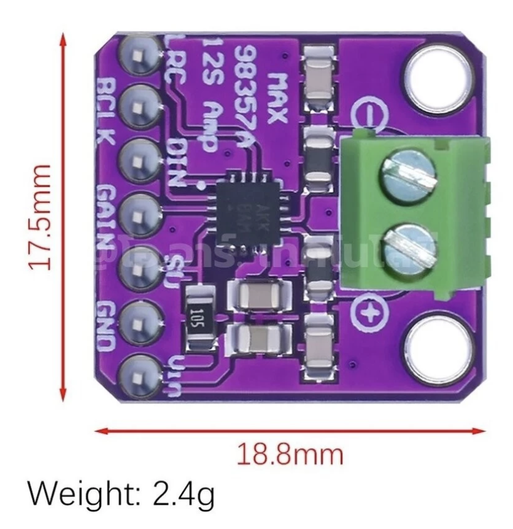 **FOR SHOPEE PURCHASE PLEASE CHOOSE THE MAX98357-S บัดกรีขา *(soldered)* OPTION** 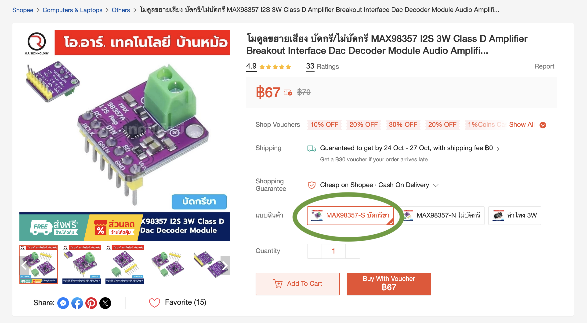 |

| Speaker | **Option A** |
| ----- | :---: |
| Component Name :  | **Aiyima 8ohm 3watt Mini Full-Range Speakers** |
| Description: | Set of two mini full-range speakers that can be daisy-chained together to create one GhostWhisper module. |
| Shopee (Thailand) Link:  | [Shopee \- SELLER NAME: AiyimaAudio.th](https://shopee.co.th/AIYIMA-2Pcs-MIni-Full-Range-Speaker-DIY-Audio-Portable-Bluetooth-Speaker-4-Ohm-3W-Home-Theater-Music-Sound-Loudspeaker-i.419982862.23102228411?sp_atk=46748790-1223-40bb-8875-37c026c24344&xptdk=46748790-1223-40bb-8875-37c026c24344) |
| | 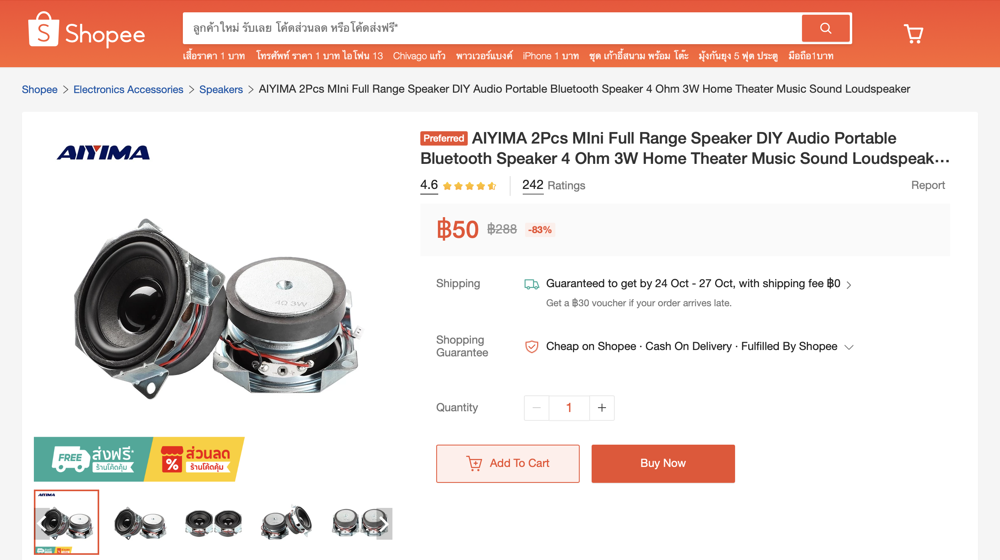  |

| Speaker | **Option B** |
| ----- | :---: |
| Component Name :  | **8ohm 20watt Horn Speaker** |
| Description: | An industrial horn speaker that can be used as an alternative to the speakers above |
| Shopee (Thailand) Link:  | [Shopee \- SELLER NAME: fkrittapas](https://shopee.co.th/ลำโพงฮอร์น-\(Industrial-Horn-Speakers\)-PH20-8นิ้ว-15-20W-8โอห์ม-“PENTON”-i.81068829.25486787205?sp_atk=254f9e18-fd71-47cd-bea9-69da84c71e64&xptdk=254f9e18-fd71-47cd-bea9-69da84c71e64) |
|  | 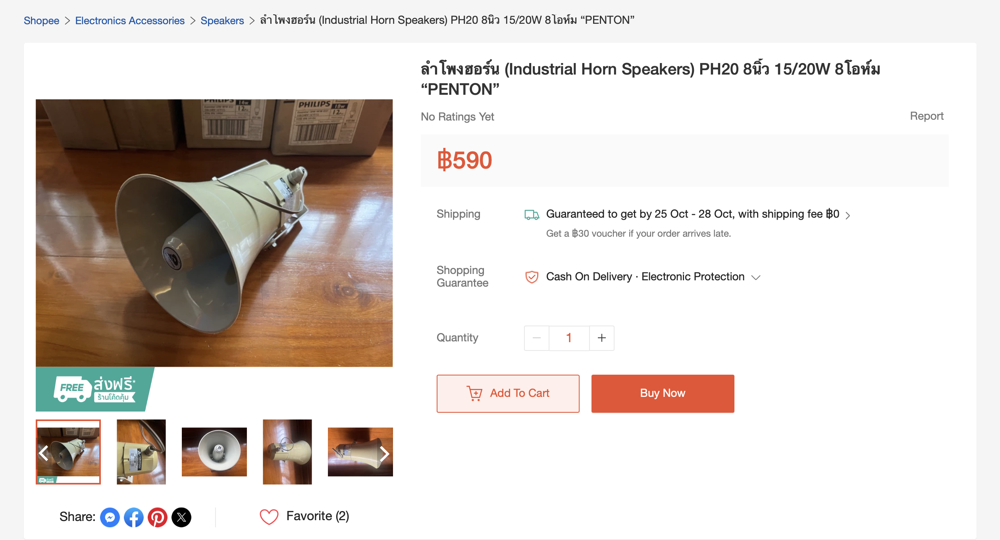  Product Details: Industrial Horn Speakers PH20 15/20W 8ohms PENTON Brand Size: 20x20x26 cm Weight: 1400 grams  |

| Component Name :  | Male to Female Dupont Wires |
| ----- | :---: |
| Description: | Used for connecting data pins to the microcontroller and amplifier module. Can also be connected to other Dupont Wire types. |
| Shopee (Thailand) Link:  | [Shopee \- SELLER NAME: AEI.th](https://shopee.co.th/สายจัมป์-10-20-30-40-ซม.-\(แผงละ-40-เส้น\)-มีให้เลือก-3-แบบ-Jumper-Wire-40p-10-20-30-40-cm-พร้อมส่งทันที!!!!-i.117988183.1866546973) |
|  | 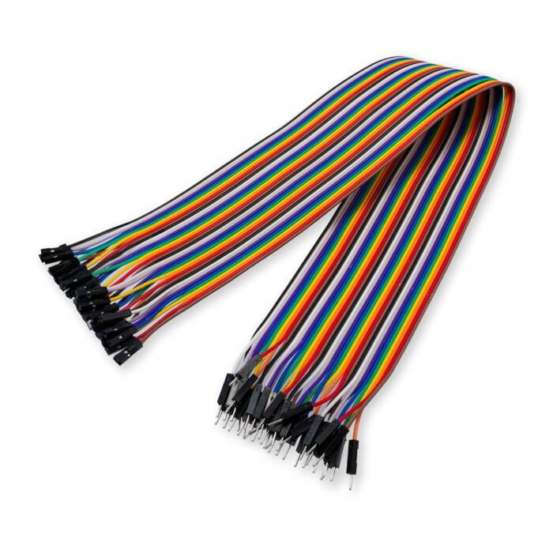 **FOR SHOPEE PURCHASE PLEASE CHOOSE THE สาย 40 CM ผู้-เมีย OPTION 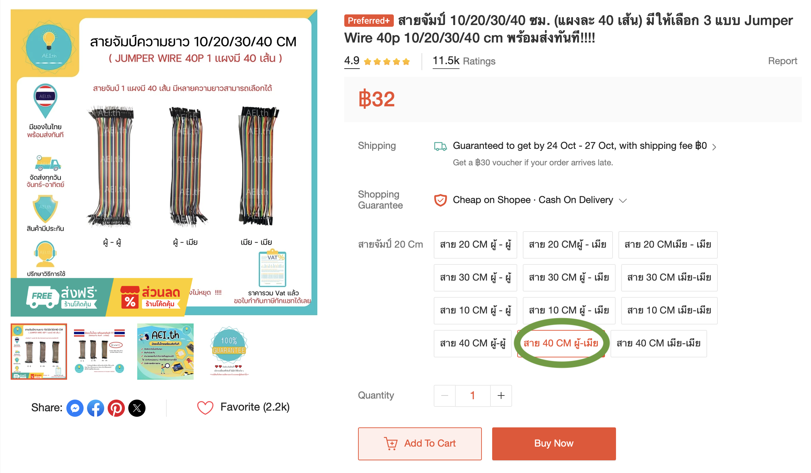** |

| Component Name :  | Female to Female Dupont Wires |
| ----- | :---: |
| Description: | Used for connecting data pins to the microcontroller and amplifier module. Can also be connected to other Dupont Wire types. |
| Shopee (Thailand) Link:  | [Shopee \- SELLER NAME: AEI.th](https://shopee.co.th/สายจัมป์-10-20-30-40-ซม.-\(แผงละ-40-เส้น\)-มีให้เลือก-3-แบบ-Jumper-Wire-40p-10-20-30-40-cm-พร้อมส่งทันที!!!!-i.117988183.1866546973) |
|  | 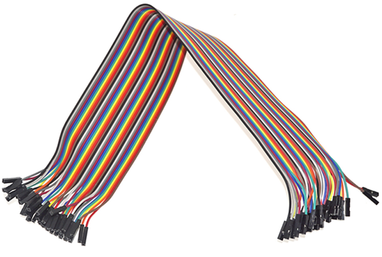 **FOR SHOPEE PURCHASE PLEASE CHOOSE THE สาย 40 CM เมีย-เมีย OPTION 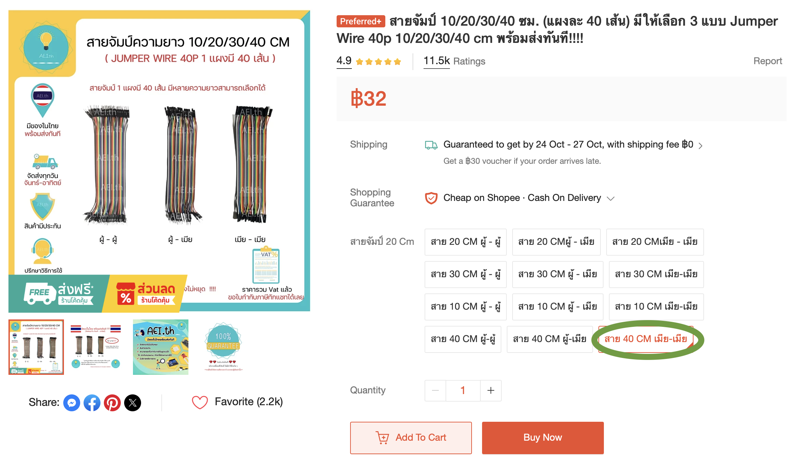** |

| Component Name :  | Power Supply Unit (5V, 3A) |
| ----- | :---: |
| Description: | Used to power the microcontroller once the work is installed. |
| Shopee (Thailand) Link:  | [Shopee \- SELLER NAME: Lantern IoT Maker](https://shopee.co.th/Adapter-5V-3A-แบบ-USB-type-C-USB-C-ใช้ได้กับ-Raspberry-PI-อแดปเตอร์-220VAC-to-5VDC-หัวไทป์ซี-Power-Supply-ราสเบอรี่พาย-i.270502312.4381642757?sp_atk=d52360ed-1b86-48e9-99bb-596ee63a3c07&xptdk=d52360ed-1b86-48e9-99bb-596ee63a3c07) |
|  | 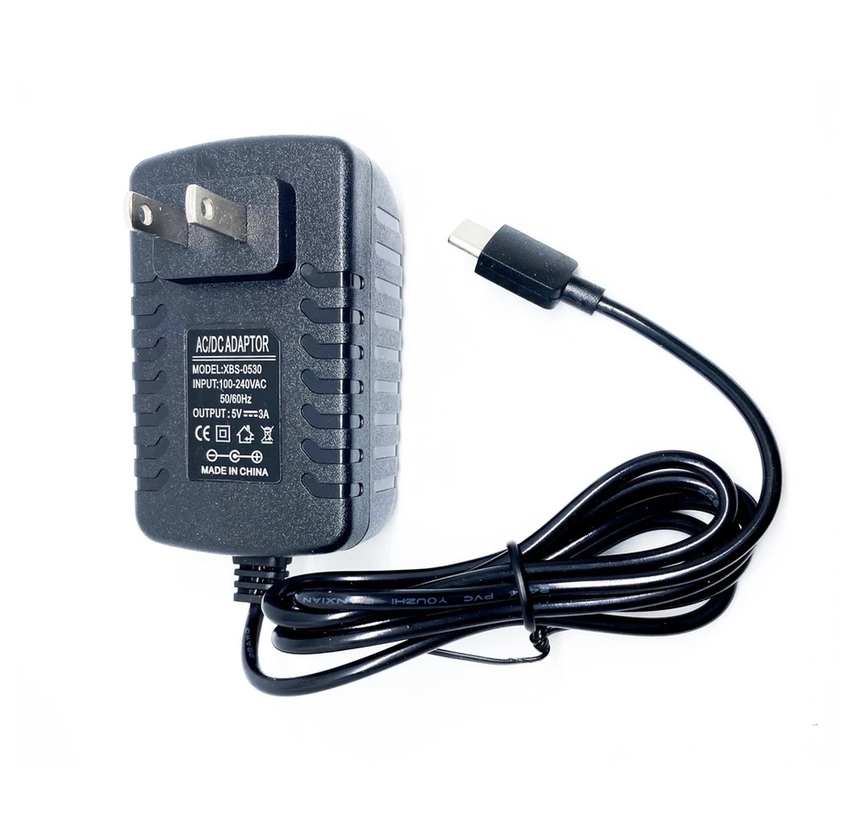 Power Consumption: 15W Power Adapter Type: 220VAC Dimension (L x W x H): 6x10x5cm Cord Length: 1 meter |

| Component Name :  | Terminal Blocks |
| ----- | :---: |
| Description: | Screw-type insulated connectors that securely fasten several wires together for electrical circuits. |
| Shopee (Thailand) Link:  | [Shopee \- SELLER NAME: SmartP Store](https://shopee.co.th/TC100A-600V-เทอร์มินอล-บล็อกต่อสายไฟ-Terminal-Block-TC1002-TC1003-TC1004-i.29111487.29962853600?sp_atk=9f73954a-e6fc-41d9-b2ad-1cf31462ef14&xptdk=9f73954a-e6fc-41d9-b2ad-1cf31462ef14) |
|  | 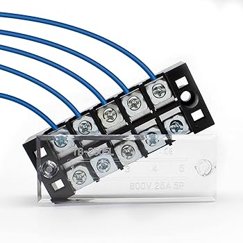 **FOR SHOPEE PURCHASE PLEASE CHOOSE THE TC-1004 OPTION, Quantity: 2pcs 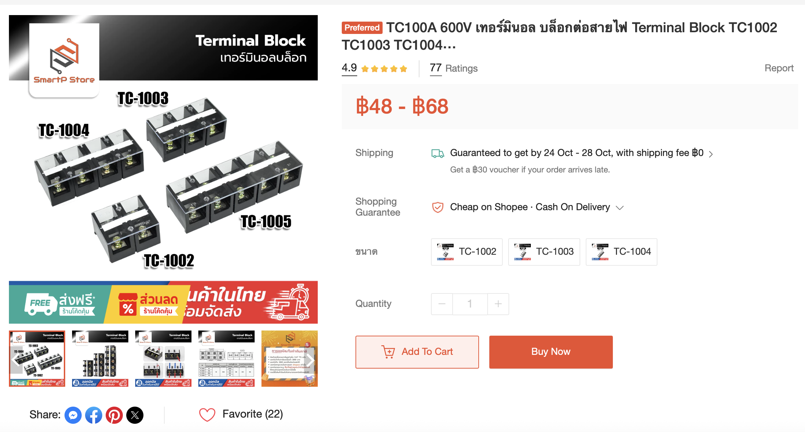** |

| Component Name :  | Heat-shrink Tubing |
| ----- | :---: |
| Description: | Heat activated tubing used to protect wire connections |
| Shopee (Thailand) Link:  | [Shopee \- SELLER NAME: AEI.th](https://shopee.co.th/ชุดท่อหด-set-Heat-Shrinkable-Tube-1-ชุด-มีหลายเส้น-พร้อมส่งทันที!!!!-i.117988183.28503560356) |
|  | **FOR SHOPEE PURCHASE PLEASE CHOOSE THE สีดำชุดท่อหด127 OPTION** 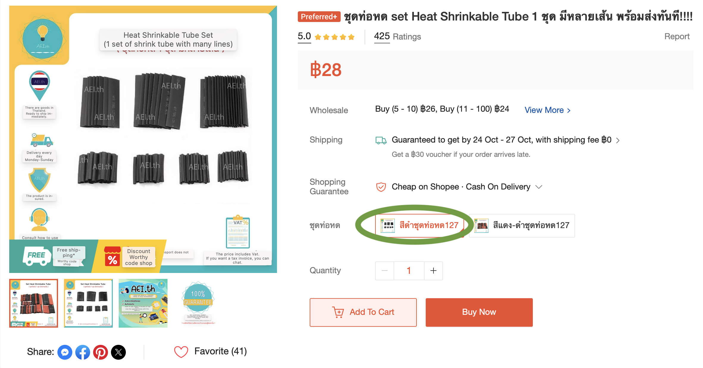 |

## Support (Contact Us)

If you would like support during assembly, kindly contact the artists in their studios in the Philippines:

**KOLOWN**  
www.kolown.net  
[kolown@gmail.com](mailto:kolown@gmail.com)  
instagram: @kolown

**ROAN ALVAREZ**  
www.roanalvarez.com    
[roanalvrz@gmail.com](mailto:roanalvrz@gmail.com)  
instagram: @roanalvarez