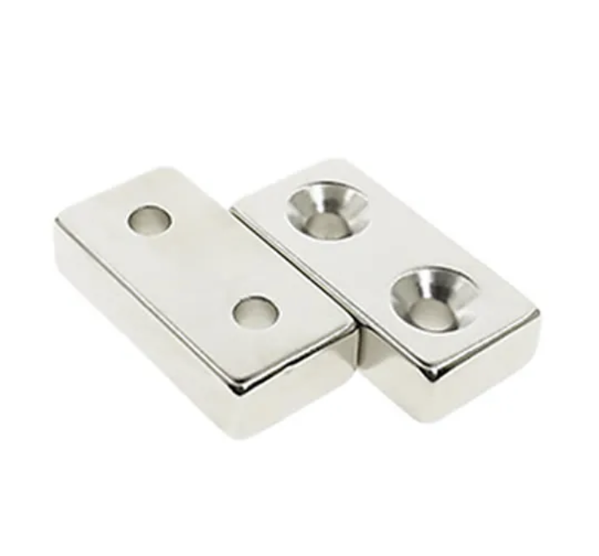
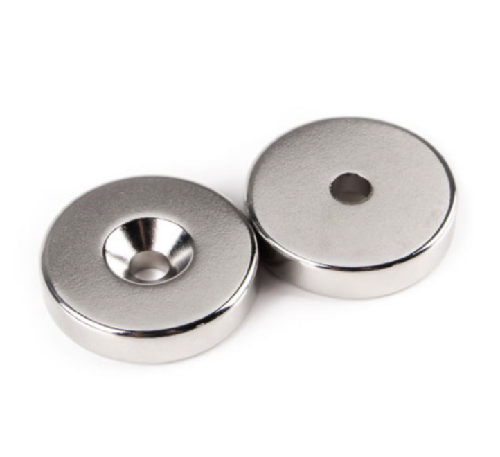

# APPENDIX I - INSTALLATION

**IMPORTANT:**  
Please refer to the **General Important Information** section for detailed system information, list of components, and wiring diagram.

**Note**: The speakers, amplifier, and the ESP32 microcontroller should be assembled together. They will be referred to in this manual as a “**module.**”

## List of Materials Needed for Installation

* Assembled module
* Neodymium magnet with countersunk hole (1-2pcs for each speaker) \[See Related Images below for recommended types\]
* Screws that will fit through the countersunk hole of the neodymium magnets
* Screwdriver (depends on the type of screws to be used)
* Drill & drill bit with a smaller diameter than the screws
* OPTIONAL:
    Spirit level / Laser level
    Carpenter’s measure

## Placement Instructions \[TO BE UPDATED\]

1. Test the module before installation by powering the ESP32 microcontroller using the Power Supply Unit. After testing, unplug the power supply before installing the module.
2. Refer to the supplied template diagram for positioning the module.  
   The piece should be installed on a flat wall.  
3. Mark and pre-drill where the screws will be placed.
4. Insert the screw through the countersunk hole of the neodymium magnet. Secure the magnet onto the wall using screws.
5. Attach the magnetic back of the speakers to the installed neodymium magnet.

## Maintenance

Always unplug the Power Supply Unit before cleaning the work.  

Strictly no water or water-based solutions should be applied as it will damage the electronics. Please do not clean the module with Windex or soap. Use a lint-free cloth or anti-static wipes/dusters. 

While cleaning the speakers, avoid applying too much pressure onto its surface, otherwise the speaker’s cone and dust cap may tear.

The ESP32 microcontroller and amplifier module should be cleaned only with 99% Isopropyl Alcohol and anti-static cleanroom wipers. Alternatively, compressed air may be used to dust off debris on the microcontroller and amplifier module, these can be purchased in regular electronics stores.

We recommend cleaning the piece at least every two months.

## Related Images
Examples of Neodymium Magnet with Countersunk Hole

