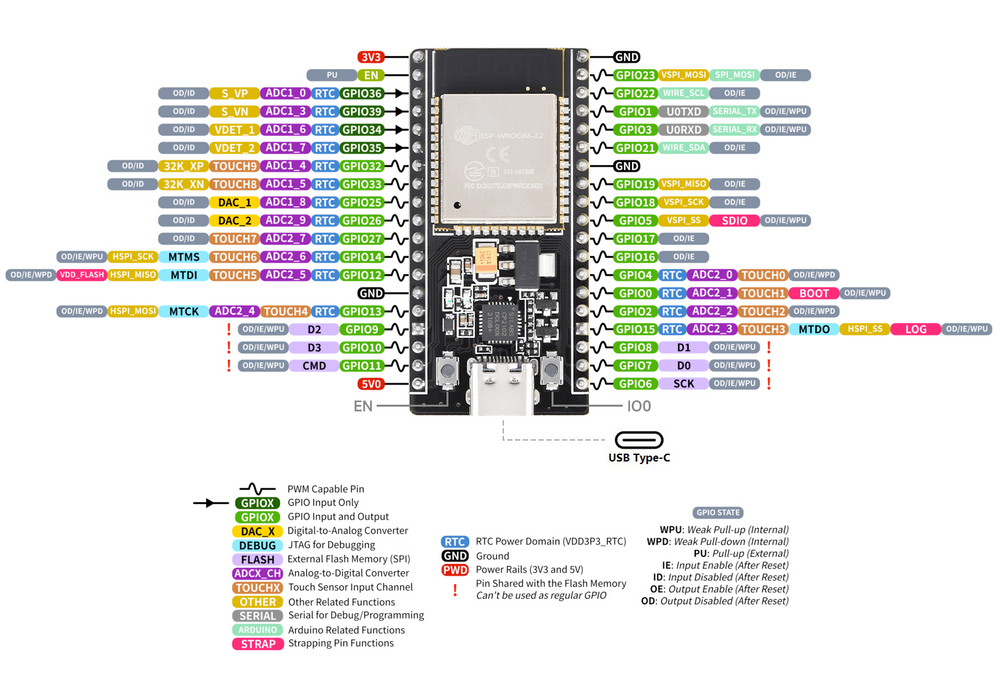
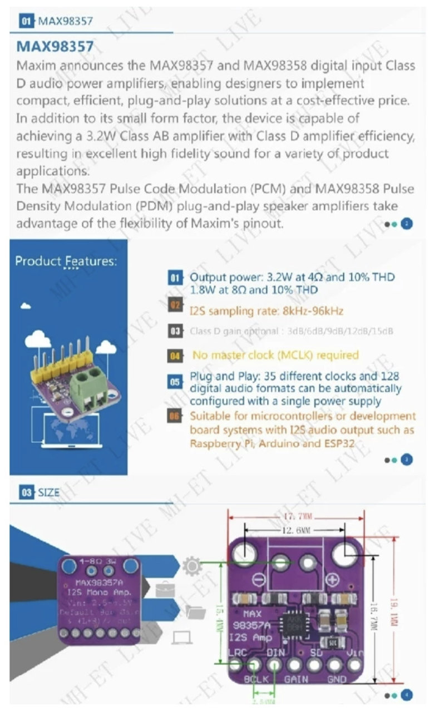
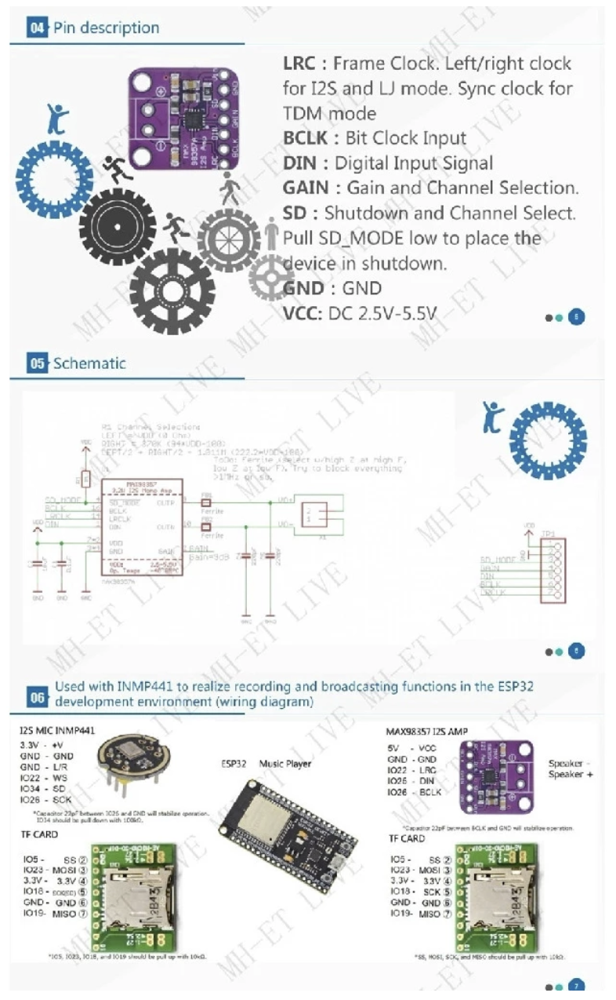

# APPENDIX II - Technical Datasheets

## NodeMCU-32S ESP32 Microcontroller

## MAX98357 Amplifier

## Aiyima Speakers
| **Frequency characteristics:** | Full band (full range) |
| :---- | :---: |
| **Rated power:** | 3 watts |
| **Rated impedance:** | 4 ohms |